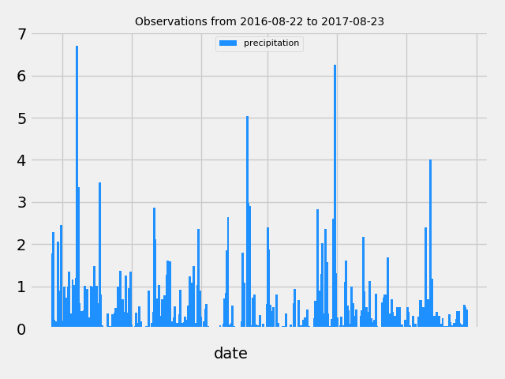
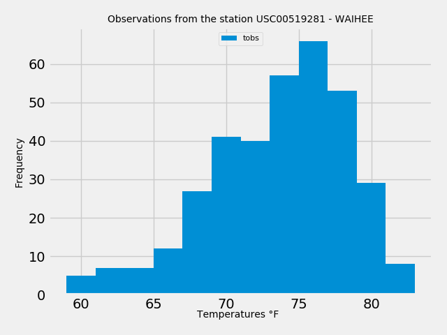
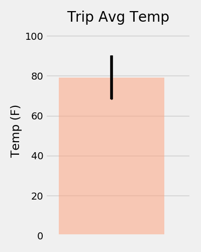
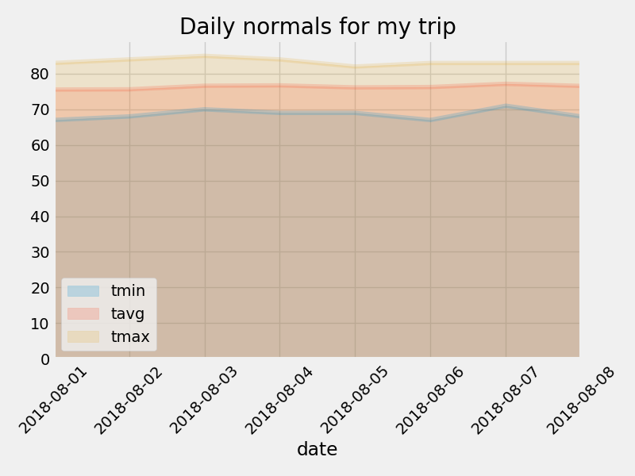
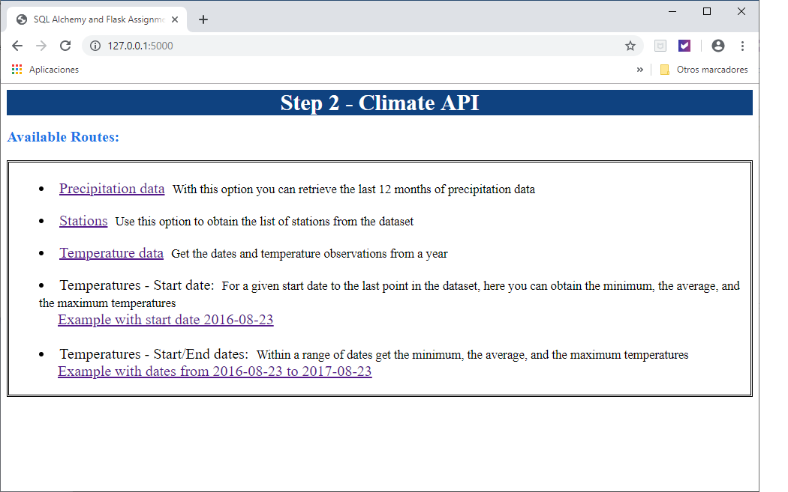

# Advanced Data Storage and Retrieval - SQLAlchemy and Flask Assignment

## Step 1 - Climate Analysis and Exploration

Python, SQLAlchemy ORM queries, Pandas and Matplotlib libraries were used to do basic climate analysis and data 
exploration of a SQLite [climate database](Resources/). This step is divided in:

 - Precipitation Analysis. Contains a query to retrieve the last 12 months of precipitation data, a plot with the 
 results and a summary statistics.

- Station Analysis. Contains a query to calculate the total number of stations, a query to find the most active 
stations, and a list of the stations and observation counts in descending order, using functions such as func.min, 
func.max, func.avg, and func.count in the queries. Also, contains a query to retrieve the last 12 months of 
temperature observation data (tobs), a filter by the station with the highest number of observations and a histogram
with the results in 12 bins.

 - Temperature Analysis. Contains the calculation of the min, avg, and max temperatures for a period of time 
 using the function `calc_temps`, and a bar chart with the results.

 - Other Recommended Analysis. Contains the rainfall per weather station using the previous year's matching dates 
and the daily normals, calculated by the function called `daily_normals`. Also, contains an area plot for these daily
normals.

### Results - Step 1

To generate the results of Step 1 go to the [Jupyter Notebook](Notebook/climate.ipynb).

## Step 2 - Climate Application

Based on the queries developed in Step 1, a Flask API  was designed. The following routes were created:

 - `/`. __Home page__. Lists all routes that are available.

 - `/api/v1.0/precipitation`. __Precitipation data__. Converts the query results to a Python Dictionary using date
 as the key and prcp as the value. Returns the JSON representation of the dictionary.

 - `/api/v1.0/stations`. __Stations__. Returns a JSON list of stations from the dataset.

 - `/api/v1.0/tobs`. __Temperature data__. Query for the dates and temperature observations from a year from 
 the last data point. Returns a JSON list of Temperature Observations (tobs) for the previous year.
 
 - `/api/v1.0/<start>`. __Temperature - Start date__. Returns a JSON list of the minimum temperature, the average 
 temperature, and the max temperature for a given start date. Calculates TMIN, TAVG, and TMAX for  all dates greater 
 than and equal to the start date.
 
 - `/api/v1.0/<start>/<end>`. __Temperature - Start/End dates__ Returns a JSON list of the minimum temperature, 
 the average temperature, and the max temperature for a given start-end range. Calculates the TMIN, TAVG, and 
 TMAX for dates between the start and end date inclusive.

### Results - Step 2

To generate the results of Step 2, run [app.py](Flask/app.py).

